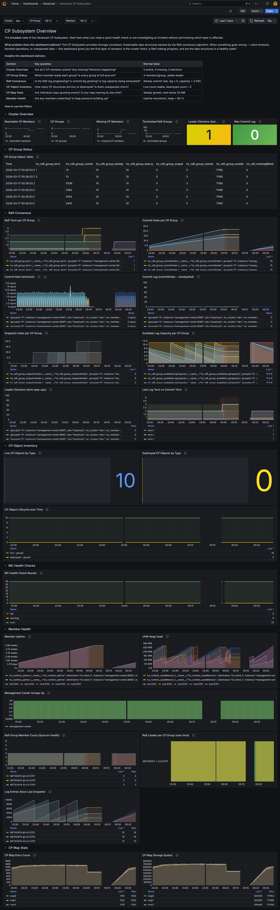
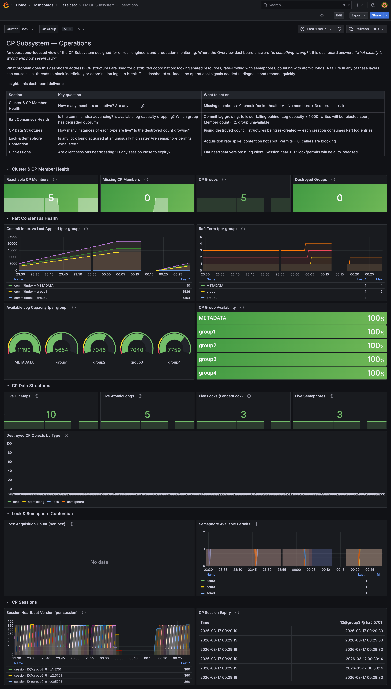
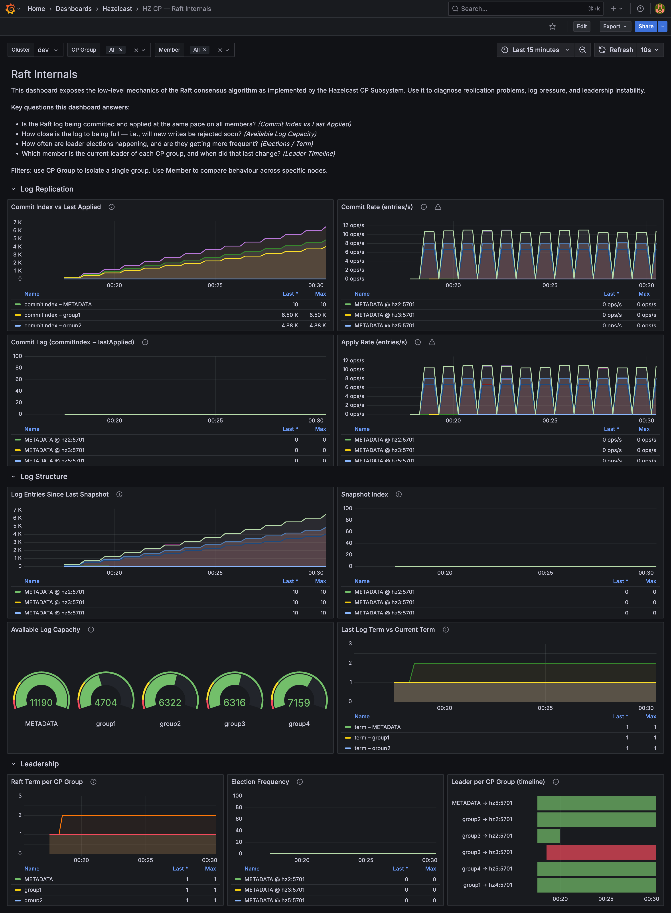
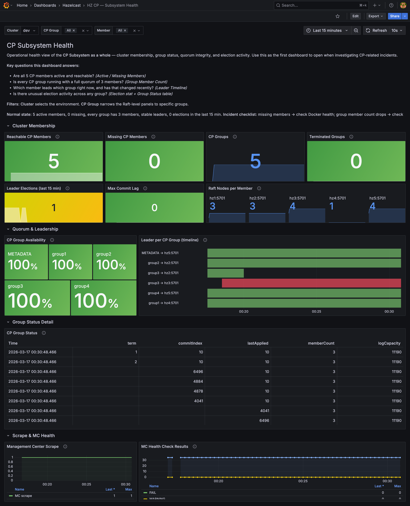
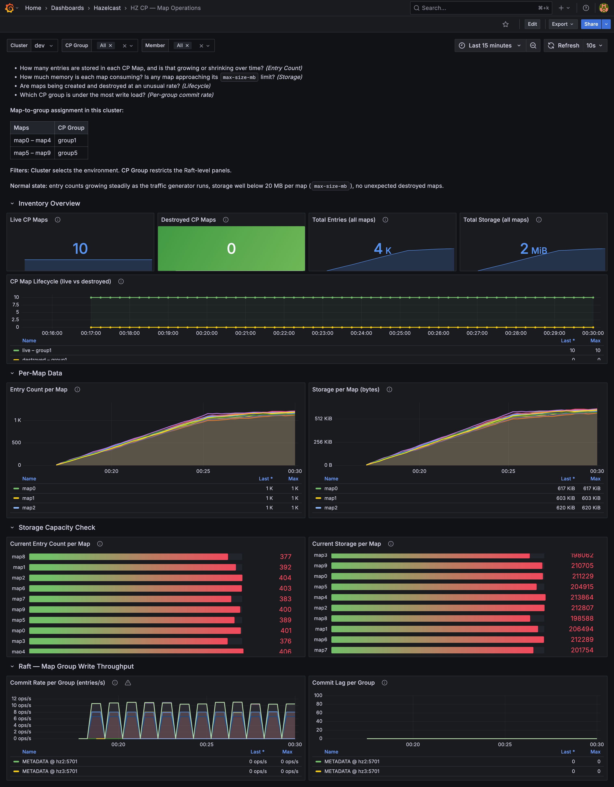
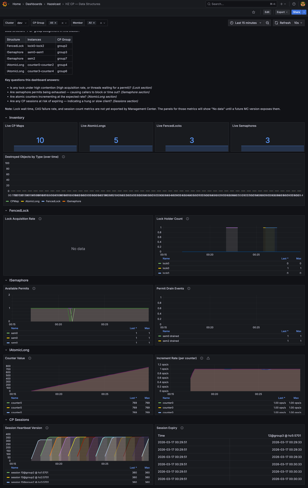

# Hazelcast CP Subsystem — Ops & Monitoring

A self-contained Docker Compose environment for running, load-testing, and monitoring the Hazelcast CP Subsystem. The stack includes a 5-node Hazelcast Enterprise cluster, Management Center, Prometheus, and Grafana with six purpose-built dashboards.

---

## Table of Contents

1. [What is the CP Subsystem?](#what-is-the-cp-subsystem)
2. [Architecture](#architecture)
3. [Prerequisites](#prerequisites)
4. [Quick Start](#quick-start)
5. [Configuration](#configuration)
6. [CP Subsystem Configuration](#cp-subsystem-configuration)
7. [Traffic Generator](#traffic-generator)
8. [Metrics Pipeline](#metrics-pipeline)
9. [Available Metrics](#available-metrics)
10. [Dashboards](#dashboards)
11. [Alerting Rules](#alerting-rules)
12. [TODO](#todo)

---

## What is the CP Subsystem?

The Hazelcast **CP Subsystem** implements the [Raft consensus algorithm](https://raft.github.io/) on top of the Hazelcast cluster to provide strongly consistent, linearizable data structures. Unlike the AP (Eventually Consistent) partition-tolerant data structures, CP structures sacrifice availability under network partition in favour of correctness.

### CP Data Structures

| Structure | Use case |
|-----------|----------|
| `CPMap` | Strongly consistent key-value store |
| `IAtomicLong` | Distributed counter with CAS semantics |
| `FencedLock` | Distributed reentrant lock with fencing tokens to prevent split-brain writes |
| `ISemaphore` | Distributed counting semaphore |
| `IAtomicReference` | Distributed reference with CAS semantics |
| `ICountDownLatch` | Distributed coordination barrier |

### CP Groups

CP structures are organised into **CP groups**. Each group is an independent Raft consensus group with its own leader, log, and term. This isolates failure domains: a slow or unhealthy group does not affect others.

- The **METADATA** group is created automatically and tracks all other groups and CP members.
- Named groups (e.g. `group1`, `group2`) are created on first use when a structure is accessed as `name@groupName`.
- Each group elects one leader among its members. With `group-size=3`, the group can tolerate **1 member failure** while maintaining quorum.

### Why Monitor the CP Subsystem?

- **CP groups can lose quorum** if too many members fail — clients will block indefinitely waiting for responses.
- **Leader elections** indicate instability (network issues, GC pauses, overload).
- **Raft log exhaustion** (log fills faster than snapshots are taken) causes writes to be rejected.
- **Replication lag** (followers falling behind the leader) can delay reads on linearizable clients.
- **Session expiry** for FencedLock and ISemaphore can cause unexpected lock releases or permit grants.

---

## Architecture

```
┌────────────────────────────────────────────────────────────────┐
│  Docker network: hz-net                                        │
│                                                                │
│  ┌──────┐ ┌──────┐ ┌──────┐ ┌──────┐ ┌──────┐                  │
│  │ hz1  │ │ hz2  │ │ hz3  │ │ hz4  │ │ hz5  │  HZ Enterprise   │
│  │:5701 │ │:5701 │ │:5701 │ │:5701 │ │:5701 │  5.6.0           │
│  └──┬───┘ └──┬───┘ └──┬───┘ └──┬───┘ └──┬───┘                  │
│     └────────┴────────┴────────┴─────────┘                     │
│                        │ cluster metrics                       │
│               ┌─────────────────┐                              │
│               │ Management      │  ← aggregates metrics from   │
│               │ Center :8080    │    all 5 members             │
│               └────────┬────────┘                              │
│                        │ /metrics (V1+V2 Prometheus format)    │
│               ┌─────────────────┐                              │
│               │ Prometheus      │  scrape interval: 15s        │
│               │ :9090           │  retention: 15d              │
│               └────────┬────────┘                              │
│                        │ PromQL                                │
│               ┌─────────────────┐                              │
│               │ Grafana  :3000  │  6 dashboards, anon auth     │
│               └─────────────────┘                              │
│                                                                │
│  ┌──────────────────┐                                          │
│  │ traffic-generator│  CPMap + FencedLock + ISemaphore +       │
│  │ (Java client)    │  IAtomicLong across group1–group7        │
│  └──────────────────┘                                          │
└────────────────────────────────────────────────────────────────┘
```

**Port mapping to host:**

| Service | Host port | Purpose |
|---------|-----------|---------|
| hz1 | 5701 | Hazelcast member |
| hz2 | 5702 | Hazelcast member |
| hz3 | 5703 | Hazelcast member |
| hz4 | 5704 | Hazelcast member |
| hz5 | 5705 | Hazelcast member |
| Management Center | 8080 | UI + Prometheus `/metrics` |
| Prometheus | 9090 | Query + alerting |
| Grafana | 3000 | Dashboards |

---

## Prerequisites

- Docker & Docker Compose v2
- A Hazelcast Enterprise license key (set as `HZ_LICENSEKEY` env var)
- To rebuild the traffic generator locally: JDK 17+ and Maven 3.9+

---

## Quick Start

```bash
export HZ_LICENSEKEY=<your-license-key>
docker compose up -d
```

Wait ~60 s for the CP subsystem to initialise (5 members must join before METADATA group is created). Then open:

- Grafana: http://localhost:3000 (no login required)
- Management Center: http://localhost:8080
- Prometheus: http://localhost:9090

To tear down and wipe all data:

```bash
docker compose down -v
```

> **Note:** The CP subsystem state is not persisted (`persistence-enabled=false`). A full `down` + `up` cycle creates a fresh CP state with new leader elections.

---

## Configuration

All runtime knobs are environment variables. Copy `.env.example` (or set them directly):

| Variable | Default | Description |
|----------|---------|-------------|
| `HZ_LICENSEKEY` | _(required)_ | Hazelcast Enterprise license |
| `HZ_CLUSTER_NAME` | `dev` | Cluster name (traffic generator) |
| `HZ_MEMBERS` | `hz1:5701,…` | Comma-separated member addresses |
| `KEY_SPACE` | `500` | Keys per CPMap |
| `VALUE_SIZE` | `512` | Payload size in bytes per write |
| `INTERVAL_MS` | `1000` | Traffic cycle interval in ms |
| `WRITE_RATIO` | `70` | % of CPMap operations that are writes |
| `READ_RATIO` | `20` | % of CPMap operations that are reads |

---

## CP Subsystem Configuration

See [hazelcast/hazelcast.xml](hazelcast/hazelcast.xml) for the full config. Key parameters:

```xml
<cp-subsystem>
  <cp-member-count>5</cp-member-count>       <!-- all 5 members participate in CP -->
  <group-size>3</group-size>                  <!-- each group: 3 members, tolerates 1 failure -->
  <session-time-to-live-seconds>60</session-time-to-live-seconds>
  <session-heartbeat-interval-seconds>5</session-heartbeat-interval-seconds>
  <missing-cp-member-auto-removal-seconds>28800</missing-cp-member-auto-removal-seconds>
</cp-subsystem>
```

### CP Groups in use

| Group | Structures |
|-------|-----------|
| `group1` | CPMaps: `map0`–`map4` |
| `group2` | FencedLocks: `lock0`–`lock2` |
| `group3` | ISemaphores: `sem0`–`sem1` |
| `group4` | IAtomicLongs: `counter0`–`counter2` |
| `group5` | CPMaps: `map5`–`map9` |
| `group6` | IAtomicLongs: `counter3`–`counter4` |
| `group7` | ISemaphores: `sem2` |
| `METADATA` | Internal — tracks all groups and CP members |

---

## Traffic Generator

[traffic-generator/](traffic-generator/) is a Java client that drives continuous load against all CP structures every second.

### Per cycle (1 s default):

| Structure | Operation | Detail |
|-----------|-----------|--------|
| CPMap (×10) | set / get / remove | 70 % writes · 20 % reads · 10 % removes |
| FencedLock (×3) | lock → sleep 2 ms → unlock | Simulates critical section |
| ISemaphore (×3) | tryAcquire(10 ms) → sleep 2 ms → release | Simulates resource pool |
| IAtomicLong (×5) | incrementAndGet | Simulates distributed counter |

### Rebuild after code change:

```bash
cd traffic-generator && mvn package -DskipTests
docker compose up -d --build traffic-generator
```

---

## Metrics Pipeline

### How metrics flow

```
Hazelcast member (×5)
  → JMX / internal stats
    → Management Center (aggregates all members)
      → /metrics  (Prometheus text format, V1 only)
        → Prometheus scrapes every 15 s
          → Grafana queries via PromQL
```

### Metric format

Management Center exports **V1 format only** (`printers=V1`):

| Format | Prefix | Notes |
|--------|--------|-------|
| V1 | `hz_` | All metrics — runtime, Raft, CP structures, members |

> Using both `printers=V1,V2` causes duplicate metric exports with the same timestamp, leading Prometheus to drop ~40 samples per scrape. V2 format (`hazelcast_*` prefix) is intentionally disabled. Do not add `V2` back.

> Raft and CP metrics use the `hz_raft_*` and `hz_cp_*` prefixes. The V2 names `hazelcast_raft_*` do not exist.

### Key labels

| Label | Values | Meaning |
|-------|--------|---------|
| `mc_cluster` | `dev` | Cluster name |
| `mc_member` | `hz1:5701` … `hz5:5701` | Individual member |
| `name` | `METADATA`, `group1` … `group7` | CP group name (on raft metrics) |
| `role` | `LEADER`, `FOLLOWER` | Member's role in that CP group |
| `group` | `group1` … `group7` | CP group name (on CP map metrics) |

---

## Available Metrics

### Raft / CP Subsystem (V1 — `hz_raft_*`)

| Metric | Labels | Description |
|--------|--------|-------------|
| `hz_raft_metadata_activeMembers` | `mc_member`, `mc_cluster` | Active CP members (only METADATA group members report non-zero) |
| `hz_raft_metadata_groups` | `mc_member`, `mc_cluster` | Total CP groups tracked by METADATA |
| `hz_raft_missingMembers` | `mc_member`, `mc_cluster` | CP members currently unreachable |
| `hz_raft_nodes` | `mc_member`, `mc_cluster` | Number of Raft nodes on this member |
| `hz_raft_destroyedGroupIds` | `mc_member`, `mc_cluster` | Count of destroyed Raft group IDs |
| `hz_raft_terminatedRaftNodeGroupIds` | `mc_member`, `mc_cluster` | Terminated Raft node group IDs |
| `hz_raft_group_term` | `name`, `role`, `mc_member` | Current Raft term. Step-up = election |
| `hz_raft_group_commitIndex` | `name`, `role`, `mc_member` | Highest committed log index |
| `hz_raft_group_lastApplied` | `name`, `role`, `mc_member` | Highest applied log index |
| `hz_raft_group_lastLogIndex` | `name`, `role`, `mc_member` | Last entry written to the log |
| `hz_raft_group_lastLogTerm` | `name`, `role`, `mc_member` | Term of the last log entry |
| `hz_raft_group_snapshotIndex` | `name`, `role`, `mc_member` | Log index at last snapshot |
| `hz_raft_group_availableLogCapacity` | `name`, `role`, `mc_member` | Remaining log slots before exhaustion |
| `hz_raft_group_memberCount` | `name`, `role`, `mc_member` | Members in this Raft group (expect 3) |
| `hz_raft_metadata_activeMembersCommitIndex` | `mc_member`, `mc_cluster` | METADATA commit index for active members |

### CP Map (V1 — `hz_cp_map_*`)

| Metric | Labels | Description |
|--------|--------|-------------|
| `hz_cp_map_size` | `name`, `group`, `mc_member` | Entry count per CPMap |
| `hz_cp_map_sizeBytes` | `name`, `group`, `mc_member` | Storage consumed per CPMap (bytes) |
| `hz_cp_map_summary_live_count` | `group`, `mc_member` | Live CPMap instances per group |
| `hz_cp_map_summary_destroyed_count` | `group`, `mc_member` | Destroyed CPMap instances per group |

### Derived metrics (Prometheus recording rules)

| Recording rule | Expression | Description |
|----------------|------------|-------------|
| `hz:cp_group:commit_lag` | `commitIndex − lastApplied` | Replication lag per group/member |
| `hz:cp_group:term_increase_rate` | `rate(term[5m])` | Election frequency |
| `hz:cp_group:commit_rate` | `rate(commitIndex[1m])` | Write throughput in entries/s |

### Member health (V1 — `hz_*`)

| Metric | Description |
|--------|-------------|
| `hz_runtime_uptime` | Member uptime (ms) |
| `hz_runtime_usedMemory` | JVM heap used (bytes) |
| `hz_runtime_freeMemory` | JVM heap free (bytes) |
| `hz_os_processCpuLoad` | Process CPU usage |
| `hz_tcp_connection_activeCount` | Active TCP connections |

---

## Dashboards

All six dashboards are provisioned automatically and available at http://localhost:3000 (no login).

### Dashboard list

| UID | Title | Focus | Preview |
|-----|-------|-------|---------|
| `hz-cp-subsystem` | CP Subsystem Overview | Broad day-to-day health: cluster, Raft, CP inventory, maps, member health | <a href="images/cp-subsystem.png"></a> |
| `hz-cp-subsystem-ops` | CP Subsystem Operations | Quorum health, contention, data structure lifecycle, sessions | <a href="images/cp-subsystem-operations.png"></a> |
| `hz-raft` | HZ CP — Raft Internals | Deep dive: log replication, commit lag, snapshots, leader elections | <a href="images/raft-internals.png"></a> |
| `hz-cp-health` | HZ CP — Subsystem Health | Membership, quorum status per group, Group Status table | <a href="images/cp-subsystem-health.png"></a> |
| `hz-cp-maps` | HZ CP — Map Operations | Per-map entry count, storage, capacity, Raft write throughput | <a href="images/cp-map-operations.png"></a> |
| `hz-cp-datastruct` | HZ CP — Data Structures | FencedLock, ISemaphore, IAtomicLong, CP Sessions inventory | <a href="images/cp-data-structures.png"></a> |

### Template variables (all dashboards)

| Variable | Source | Description |
|----------|--------|-------------|
| `$cluster` | `label_values(…, mc_cluster)` | Selects the Hazelcast cluster |
| `$cp_group` | `label_values(hz_raft_group_term, name)` | Multi-select CP group filter |
| `$member` | `label_values(…, mc_member)` | Multi-select member filter |

---

### Dashboard 1 — CP Subsystem Overview (`hz-cp-subsystem`)

Broad operational view, designed for day-to-day health monitoring.

#### Row: Cluster Overview

| Panel | Type | Metric | What to watch |
|-------|------|--------|---------------|
| Reachable CP Members | Bar chart | `max(activeMembers) - max(missingMembers)` | Should always be 5. Reacts immediately when a member drops (unlike `activeMembers` alone which only updates after 8 h formal removal) |
| CP Groups | Bar chart | `max(hz_raft_metadata_groups)` | Stable count; increases only on new group creation |
| Missing CP Members | Bar chart | `max(hz_raft_missingMembers)` | Must be 0. Any value > 0 = alert |
| Terminated Raft Groups | Bar chart | `max(hz_raft_terminatedRaftNodeGroupIds)` | Must be 0 |
| Leader Elections (15 min) | Stat | `sum(changes(hz_raft_group_term[15m]))` | Occasional elections are normal; frequent ones are not |
| Max Commit Lag | Stat | `max(commitIndex − lastApplied)` | High value = follower falling behind |

#### Row: CP Group Status

| Panel | Type | What it shows |
|-------|------|---------------|
| CP Group Status Table | Table | Snapshot of term, commitIndex, memberCount and role for every group × member |
| Raft Leader per CP Group | State timeline | Which member leads each group over time — changes on elections |

#### Row: Raft Consensus

| Panel | Metric | What to watch |
|-------|--------|---------------|
| Raft Term | `hz_raft_group_term` | Flat = stable. Step-up = election |
| Commit Index | `hz_raft_group_commitIndex` | Steady increase = healthy write throughput |
| Commit Rate | `rate(commitIndex[1m])` | Drops to 0 under no load; spike may indicate burst |
| Commit Lag | `commitIndex − lastApplied` | Should be near 0 in steady state |
| Snapshot Index | `hz_raft_group_snapshotIndex` | Increases periodically as snapshots are taken |
| Available Log Capacity | `hz_raft_group_availableLogCapacity` | Alert if this drops toward 0 |
| Leader Elections | `changes(hz_raft_group_term[$interval])` | Spike = instability |
| Log Term vs Last Log Term | `term` vs `lastLogTerm` | Divergence can indicate split-brain recovery |
| Group Member Count | `hz_raft_group_memberCount` | Must be ≥ 2 (quorum). Drop to 1 = group unavailable |
| Raft Leader per CP Group | State timeline | See which member leads each group, track changes |
| Log Entries Since Snapshot | `lastLogIndex − snapshotIndex` | Approaches 10 000 before next snapshot |

#### Row: CP Object Inventory

| Panel | Metric | What it shows |
|-------|--------|---------------|
| Live CP Maps | `hz_cp_map_summary_live_count` | Active CPMap count per group |
| Destroyed CP Maps | `hz_cp_map_summary_destroyed_count` | Destroyed CPMap count (churn indicator) |
| CP Object Lifecycle | Both above over time | Trend of creation vs destruction |

#### Row: CP Map Stats

| Panel | Metric | What to watch |
|-------|--------|---------------|
| CP Map Entry Count | `hz_cp_map_size` | Per-map entry distribution |
| CP Map Storage | `hz_cp_map_sizeBytes` | Per-map memory footprint |

#### Row: Member Health

| Panel | Metric | What to watch |
|-------|--------|---------------|
| Member Uptime | `hazelcast_runtime_up_time_seconds_total` | Unexpected reset = member restart |
| JVM Heap Used | `hazelcast_runtime_used_memory_bytes` | High heap = GC pressure, risk of pauses causing elections |

---

### Dashboard 2 — CP Subsystem Operations (`hz-cp-subsystem-ops`)

Deeper operational view focused on quorum health, contention, and data structure lifecycle.

#### Row: Cluster & CP Member Health

| Panel | Type | Thresholds |
|-------|------|------------|
| Reachable CP Members | Stat (green ≥ 5 / yellow ≥ 3 / red < 3) | `activeMembers − missingMembers`. Reacts immediately when a member drops. 5 = healthy, < 3 = quorum at risk |
| Missing CP Members | Stat (green = 0 / red ≥ 1) | Any missing member is an alert condition |
| CP Groups | Stat | Should remain stable |
| Destroyed Groups | Stat (green = 0 / orange ≥ 1) | Unexpected destruction of a CP group |

#### Row: Raft Consensus Health

| Panel | Type | What to watch |
|-------|------|---------------|
| Commit Index vs Last Applied | Time series | Gap = replication lag. Persistent gap = follower issue |
| Raft Term | Time series | Step pattern = elections. Rapid steps = instability |
| Available Log Capacity | Gauge (max 11 200) | Red zone < 1 000 — writes will be rejected at 0 |
| Group Member Count | Stat per group | 3 = healthy, 2 = degraded, 1 = unavailable |

#### Row: CP Data Structures

| Panel | What it shows |
|-------|---------------|
| Live CP Maps / AtomicLongs / Locks / Semaphores | Current count per type |
| Destroyed CP Objects by Type | Bar chart over time — high churn = anti-pattern |

#### Row: Lock & Semaphore Contention

| Panel | Metric | What to watch |
|-------|--------|---------------|
| Lock Acquisition Rate | `rate(hz_cp_lock_acquireCount[1m])` | High rate on one lock = contention bottleneck |
| Semaphore Available Permits | `hz_cp_semaphore_available` | Drops to 0 = all permits acquired, clients will block |

#### Row: CP Sessions

| Panel | What to watch |
|-------|---------------|
| Session Heartbeat Version | Flat line = session stopped heartbeating → expiry risk |
| Session Expiry Table | Sessions close to their TTL with no heartbeat = hung client |

---

### Dashboard 3 — Raft Internals (`hz-raft`)

Deep dive into Raft consensus mechanics. Use this when diagnosing slow writes, replication lag, or frequent elections.

#### Row: Log Replication

| Panel | Metric | What to watch |
|-------|--------|---------------|
| Commit Index vs Last Applied | `hz_raft_group_commitIndex` / `hz_raft_group_lastApplied` | Gap = application backlog. Persistent gap = overloaded state machine |
| Commit Rate | `rate(commitIndex[1m])` | Write throughput in entries/s per group |
| Apply Rate | `rate(lastApplied[1m])` | Application throughput; should track commit rate |
| Commit Lag | `commitIndex − lastApplied` | Near zero in steady state; spike = application falling behind |

#### Row: Log Structure

| Panel | Metric | What to watch |
|-------|--------|---------------|
| Log Entries Since Snapshot | `lastLogIndex − snapshotIndex` | Approaches 10 000 (commit-index-advance-count-to-snapshot) before next snapshot |
| Snapshot Index | `hz_raft_group_snapshotIndex` | Steps up periodically; long flat = no snapshots taken (log growing unbounded) |
| Available Log Capacity | `hz_raft_group_availableLogCapacity` | Gauge: approaches 0 as log fills. Writes rejected at 0 |

#### Row: Leadership

| Panel | Metric | What to watch |
|-------|--------|---------------|
| Last Log Term vs Raft Term | `hz_raft_group_lastLogTerm` vs `hz_raft_group_term` | Divergence during leader election; should converge |
| Raft Term | `hz_raft_group_term` | Flat = stable. Step = election |
| Election Frequency | `changes(hz_raft_group_term[$__interval])` | Any non-zero = election occurred in that window |
| Raft Leader per CP Group | State timeline of `hz_raft_group_term{role="LEADER"}` | Track which member leads each group; transitions = elections |

---

### Dashboard 4 — Subsystem Health (`hz-cp-health`)

Membership and quorum health at a glance. Use this for on-call triage when CP alarms fire.

#### Row: Cluster Membership

| Panel | Metric | Thresholds |
|-------|--------|------------|
| Reachable CP Members | `max(activeMembers) − max(missingMembers)` | green=5, yellow≥3, red<3 |
| Missing CP Members | `max(hz_raft_missingMembers)` | green=0, red≥1 |
| Total CP Groups | `max(hz_raft_metadata_groups)` | stable; increase = new group created |

#### Row: Quorum & Leadership

| Panel | What to watch |
|-------|---------------|
| Group Member Count | Stat per group with thresholds: 3=green, 2=orange, 1=red. 1 = group unavailable |
| Leader per Group | State timeline — which member leads each group over time |

#### Row: Group Status Detail

Full table: every group × member combination with `term`, `commitIndex`, `memberCount`, and `role`. Sort by `term` descending to spot lagging groups.

#### Row: Scrape & MC Health

| Panel | What to watch |
|-------|---------------|
| Scrape Targets Up | `up{job="hazelcast"}` — must be 1. 0 = MC unreachable, all CP metrics gone |

---

### Dashboard 5 — Map Operations (`hz-cp-maps`)

Per-map entry counts, storage consumption, capacity headroom, and Raft write throughput.

#### Row: Inventory Overview

| Panel | Metric | What to watch |
|-------|--------|---------------|
| Total CP Map Entries | `sum(max by (name)(hz_cp_map_size))` | Overall key count across all maps |
| Total CP Map Storage | `sum(max by (name)(hz_cp_map_sizeBytes))` | Total bytes; watch for growth |
| Live Map Instances | `hz_cp_map_summary_live_count` | Per-group live CPMap count |
| Destroyed Map Instances | `hz_cp_map_summary_destroyed_count` | Churn indicator |

#### Row: Per-Map Data

| Panel | Metric | What to watch |
|-------|--------|---------------|
| Entry Count per Map | `hz_cp_map_size` per `name` | Uneven distribution = hotspot |
| Storage per Map | `hz_cp_map_sizeBytes` per `name` | Maps approaching `max-size-mb` |

#### Row: Storage Capacity Check

Gauge per map: `sizeBytes / max_size_mb` as a percentage. Alert threshold at 80 %.

#### Row: Raft Write Throughput

Commit rate per CP group (`group1`, `group5`) — shows how fast map writes are being committed to the Raft log.

---

### Dashboard 6 — Data Structures (`hz-cp-datastruct`)

FencedLock, ISemaphore, IAtomicLong, and CP Session health.

#### Row: Inventory

| Panel | Metric | What it shows |
|-------|--------|---------------|
| Live Maps | `hz_cp_map_summary_live_count` | Per-group live CPMap count |
| Lock acquire rate | `rate(hz_cp_lock_acquireCount[1m])` | Lock throughput per lock name |
| Semaphore Available | `hz_cp_semaphore_available` | Permits remaining; 0 = blocked clients |
| AtomicLong value | `hz_cp_atomiclong_value` | Current counter values |

#### Row: FencedLock

Lock acquisition rate per lock (`lock0`–`lock2` in `group2`). High and sustained rate on one lock = contention bottleneck.

#### Row: ISemaphore

Available permits over time (`sem0`–`sem2` across `group3`, `group7`). Permits touching 0 and recovering = healthy load. Staying at 0 = overloaded.

#### Row: IAtomicLong

Counter values over time (`counter0`–`counter4` across `group4`, `group6`). Slope = increment rate; flatline = traffic stopped.

#### Row: CP Sessions

| Panel | What to watch |
|-------|---------------|
| Session Heartbeat Version | Step-counter per session. Flatline = session stopped heartbeating → expiry in ≤ 60 s |
| Session Expiry Table | All active sessions with their expiration time. Sessions close to expiry with no recent heartbeat = potential stuck client |

---

## Alerting Rules

Defined in [prometheus/rules/cp-subsystem.yml](prometheus/rules/cp-subsystem.yml):

| Alert | Condition | Severity | Meaning |
|-------|-----------|----------|---------|
| `CPMemberDown` | `up{job="hazelcast"} == 0` for 30 s | critical | MC lost connectivity to the cluster |
| `CPMissingMembers` | `hz_raft_missingMembers > 0` for 30 s | critical | CP member unreachable — quorum may be at risk |
| `CPGroupLeaderElection` | `changes(hz_raft_group_term[5m]) > 0` | warning | A leader election occurred in any CP group |
| `CPGroupHighCommitLag` | `hz:cp_group:commit_lag > 100` for 1 m | warning | A follower is significantly behind the leader |

> **Note:** The recording rules in `cp-subsystem.yml` still reference the non-existent V2 names (`hazelcast_raft_*`). They need to be updated to use the actual V1 names (`hz_raft_*`).

---

## TODO

See [TODO.md](TODO.md) for the full backlog.
